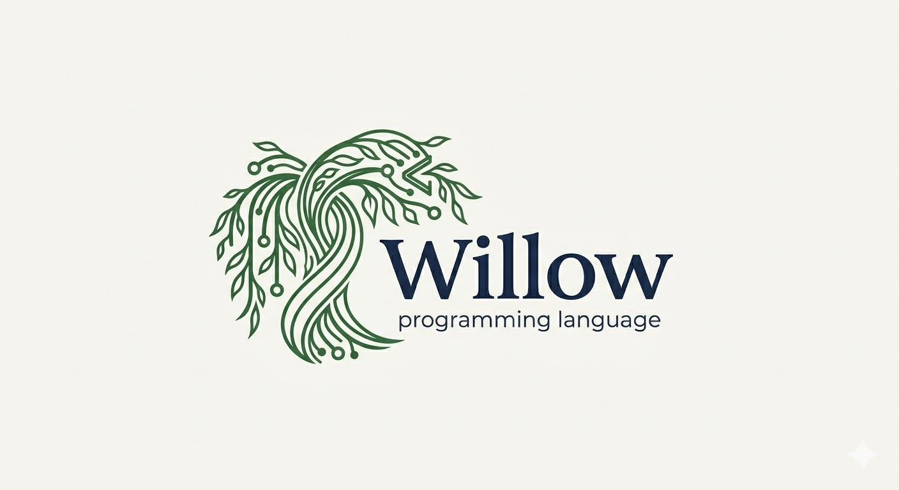

<div align="center">



# Willow

*The Willow programming language.*

<br />

[](https://en.wikipedia.org/wiki/C_%28programming_language%29)
[](https://www.microsoft.com/windows)
[](https://kernel.org)
[](https://en.wikipedia.org/wiki/X86-64)

</div>

<br />

## Overview

Willow is a small language project: the goal is to **build a compiler** in **C** for **Windows** and **Linux** on **x86_64**. There is no big roadmap yet—it is an experiment because it sounds like a good time.

A sample program that is intended to be **valid Willow** once the toolchain exists lives in **[`Examples/Example.wil`](Examples/Example.wil)**.

---

## Usage

Run the executable from a shell. Pass a single argument: the path to a Willow source file.

---

## Building

**Prerequisites**

- [CMake](https://cmake.org/) 3.14 or newer
- A C compiler—we develop and test with [GCC](https://gcc.gnu.org/) (GNU Compiler Collection), but any capable C toolchain should work

**Steps**

1. Configure a build directory:

   ```bash
   cmake -B build
   ```

2. Compile:

   ```bash
   cmake --build build
   ```

The resulting executable will be produced under the build tree (exact path depends on your generator and platform).
